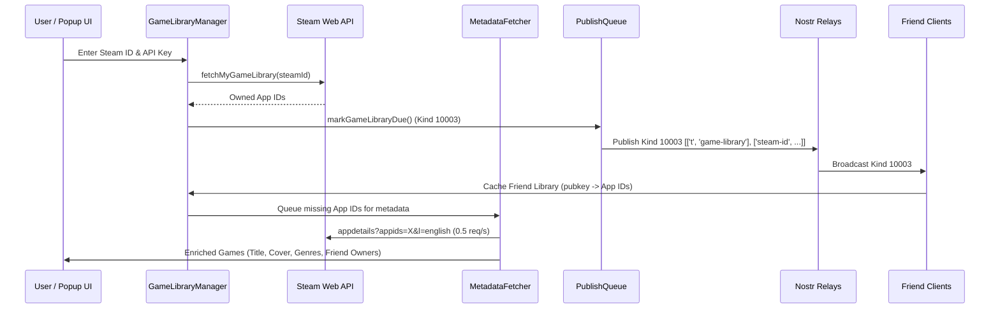

# Steam Game Discovery & Library Sharing Specification

## 1. Overview

The Games tab in Hang Time allows users to connect their Steam account, automatically synchronize their owned game library with friends over Nostr, and browse games with multi-dimensional filtering, metacritic sorting, and friend ownership indicators.

---

## 2. Architecture & Data Flow



---

## 3. Nostr Kind 10003 Protocol

Game libraries are shared across Nostr using replaceable Kind `10003` events:

### Event Format
```json
{
  "kind": 10003,
  "pubkey": "<user_nostr_pubkey>",
  "created_at": 1787259000,
  "tags": [
    ["t", "game-library"],
    ["steam-id", "76561198000000000"]
  ],
  "content": "{\"appIds\":[730,570,440,221100],\"count\":4,\"timestamp\":1787259000000}"
}
```

- **Subscription Filter**: `RelayConnection._sendSubscription` listens for `kinds: [10003]`.
- **Handling**: `background.ts` routes Kind `10003` events with tag `['t', 'game-library']` to `GameLibraryManager.handleGameLibraryEvent(event)`.
- **Storage**: Cached in `STORAGE_KEYS.FRIEND_GAME_LIBRARIES` indexed by friend `pubkey` and `uuid`.

---

## 4. Steam Metadata Fetcher & Multi-Tier Caching

### 4.1 English Language Forcing & Cache Repair
Steam's `appdetails` endpoint defaults to GeoIP/server locale if unassigned. `MetadataFetcher` enforces English metadata:
```
https://store.steampowered.com/api/appdetails?appids=${appId}&l=english
```
- **Staleness & Cyrillic Detection**: If cached metadata contains Cyrillic characters `[\u0400-\u04FF]` (legacy unlocalized cache entries), `isCacheStale()` immediately marks the entry as stale and triggers a background re-fetch in English.

### 4.2 Rate Limiting & Queue
- Rate limited to **0.5 requests/second** (1 request every 2 seconds) to avoid Steam HTTP 429 rate limits.
- Background worker processes queued games with exponential backoff on retryable network errors.

---

## 5. UI Features & Controls

The Games tab controller (`src/ui/games.ts`) provides:
1. **Filtering**:
   - **Genres**: Action, Strategy, RPG, Adventure, Simulation, Puzzle, Sports, Racing.
   - **Modes**: Single-player, Multi-player, Co-op, MMO.
   - **Playtime**: All, Played Recently (< 2 weeks), Unplayed (0 hrs).
2. **Sorting**:
   - **Most Friends Own It**: Prioritizes multiplayer titles with the highest friend ownership.
   - **Highest Score**: Sorts by Metacritic score.
   - **Most Recently Played**: Sorts by last played timestamp.
   - **Alphabetical**: A–Z sort.
3. **Friend Ownership Chips**:
   - Cards display avatars/names of all friends who own each game with a `[Invite]` button that opens `showInviteModal` to schedule a game session.
