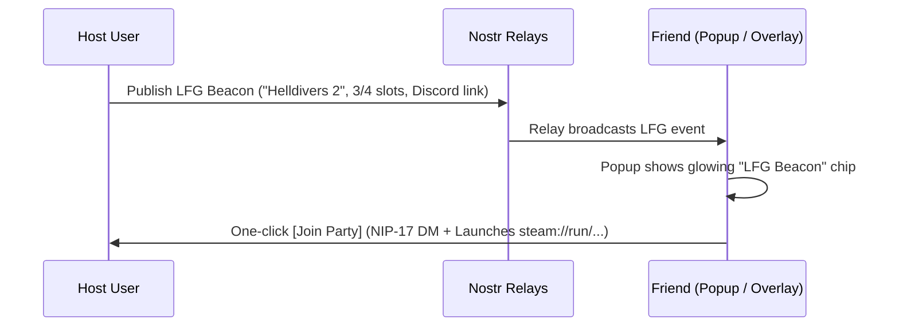

# Hang Time - Gaming Expansion Roadmap & Specification

## 1. Executive Summary & Vision

Hang Time aims to be the premier decentralized social layer for PC gamers. While the foundation currently provides **Steam library sync**, **Kind-10004 Nostr publishing**, and **Steam invite modals**, this roadmap outlines the architectural plan to expand into:
1. **Multi-Storefront PC Library Aggregation** (Steam + GOG.com + itch.io + PC Xbox Game Pass).
2. **1-Click Game Launching & Deep Linking** (`steam://`, `goggalaxy://`).
3. **PC Emulation & Classic Gaming Presence** (RetroAchievements.org).
4. ~~Competitive PC Presence (Riot Games)~~ — **blocked**, see §5.
5. **In-Browser & Cloud Gaming Detection** (Lichess, Chess.com, GeForce NOW, Xbox Cloud).
6. **Smart Co-op Matchmaking** ("Mutual Co-op", Multi-friend library overlap).
7. **Decentralized Nostr LFG (Looking For Group) & Party Beacons**.

---

## 2. PC Storefronts & Library Aggregation (Zero-OAuth)

```
┌───────────────────────────────────────────────────────────────────────────┐
│                       Hang Time Unified PC Library                        │
└──────┬───────────────────────┬───────────────────────┬───────────┬───────┘
       │                       │                       │           │
       ▼                       ▼                       ▼           ▼
 ┌───────────┐           ┌───────────┐           ┌───────────┐ ┌─────────┐
 │   Steam   │           │  GOG.com  │           │ PC Game   │ │ itch.io │
 │ Web API   │           │  Public   │           │ Pass/Xbox │ │ (user   │
 │ (SteamID) │           │ (Username)│           │ (OpenXBL) │ │ API key)│
 └───────────┘           └───────────┘           └───────────┘ └─────────┘
```

### 2.1 Steam *(Current Foundation)*
- **Configuration**: Steam ID (64-bit) + Steam Web API Key.
- **Capabilities**: Full library extraction (`IPlayerService/GetOwnedGames`), live playing presence, and Steam store metadata fetching.

### 2.2 GOG.com (Good Old Games / GOG Galaxy)
- **Status**: ⚠️ **Unofficial, expect breakage.** No official public library API exists outside the desktop-only GOG Galaxy SDK, which a browser extension can't use. The endpoint below is the same one GOG's own public profile pages call, but it's undocumented and unversioned — same risk class as the reverse-engineered Origin/Ubisoft integrations this roadmap deliberately excludes (see maintenance note below). Treat as a "best-effort, may silently break" integration, not a peer of Steam's official API.
- **Configuration**: **GOG Username only** (Zero API Key required).
- **Endpoint**: `https://embed.gog.com/u/<username>/games/stats?sort=date_last_played` (requires public profile in GOG privacy settings).
- **Capabilities**:
  - Full native GOG PC game catalog.
  - Total playtime and recent sessions.
  - Normalized directly into `GameLibraryManager` to complement Steam games.
  - **Cannot detect active game** — owned/library data only, no live presence.

### 2.3 itch.io
- **Configuration**: **Per-user itch.io API key** (generated by the user at `itch.io/user/settings/api-keys` — same trust model as Steam's user Web API key, not OAuth).
- **Endpoint**: `GET https://itch.io/api/1/<key>/my-games` (official, documented).
- **Capabilities**:
  - Owned/published indie game catalog.
  - **Cannot detect active game** — itch.io does not expose a presence API.

### 2.4 PC Xbox Game Pass / Microsoft Store
- **Scope note**: Restrict this integration to PC/Game Pass titles only. CLAUDE.md's MVP scope explicitly excludes console game detection, and OpenXBL's presence endpoint reports Xbox **console** activity too — filter or ignore non-PC titles so this doesn't silently reintroduce console tracking.
- **Trust note**: OpenXBL (`xbl.io`) is a third-party broker sitting between the user's Microsoft account and Hang Time — the user's Xbox credentials/tokens flow through infrastructure Hang Time doesn't control. This is a different trust class than Steam/GOG's first-party endpoints; call this out explicitly in the settings UI when the user connects it.
- **Configuration**: **Gamertag + OpenXBL API Key** (`xbl.io`).
- **Endpoints**:
  - Presence: `GET https://xbl.io/api/v2/presence`
  - Titles: `GET https://xbl.io/api/v2/titlehub/titles`
- **Capabilities**:
  - Live active game detection for titles running via the Windows Xbox App / Microsoft Store (Halo, Forza, Sea of Thieves, Starfield).
  - Highlights shared PC Game Pass games owned across friends.

---

## 3. 1-Click Game Launching & Deep Linking

Transform the extension from a passive tracker into an active PC game launcher by utilizing OS-registered protocol handlers:

| Platform | Protocol URI Pattern | Action |
| :--- | :--- | :--- |
| **Steam** | `steam://run/<appId>` | Launches game executable on PC directly. |
| **Steam Lobby** | `steam://joinlobby/<appId>/<lobbyId>/<steamId>` | Jumps directly into a friend's active multiplayer lobby. |
| **GOG Galaxy** | `goggalaxy://openGameView/<gameId>` | Opens game page or launches via GOG Galaxy. |
| **Xbox PC** | `ms-windows-store://pdp/?ProductId=<id>` | Launches or opens Microsoft Store / Game Pass title. |

### UI Integration:
- In the **Games tab** and **Invite Modal**, game cards display a **`[🚀 Launch]`** button.
- Clicking the button opens the protocol URL (`window.location.assign('steam://run/...')`), instantly launching the game on the user's desktop without switching windows manually.

---

## 4. PC Emulation & Classic Gaming (RetroAchievements)

For retro enthusiasts playing via emulators on PC (RetroArch, Dolphin, PCSX2, DuckStation, PPSSPP):

- **Configuration**: **Username + Web API Key** (generated in RetroAchievements account settings).
- **Endpoint**: `https://retroachievements.org/API/API_GetUserSummary.php?u=<user>&y=<apiKey>`.
- **Capabilities**:
  - **Live Presence**: Detects real-time active emulator session (e.g., *"Playing Super Mario 64 (N64) on RetroArch"*).
  - **Retro Library**: Tracks classic retro games played and unlocked achievements.
  - **Activity Feed**: Broadcasts milestone achievements to friends over Nostr.

---

## 5. Competitive PC Gaming Presence (Riot Games) — ⛔ BLOCKED, not currently feasible

For PC games operating outside Steam (League of Legends, Valorant, Teamfight Tactics):

- **Why blocked**: Riot's personal developer API keys expire every 24 hours and are documented as local-development-only — not for distribution to end users. Shipping this feature would require every Hang Time user to register their own Riot developer account and manually regenerate a key daily, which is not viable UX. A production key would remove the expiry, but Riot's production key approval process requires demonstrating a deployed product and an approved use case, which is a slow, uncertain external gate rather than something plannable as an implementation phase.
- **Revisit condition**: Re-open this only if/when a Riot production API key is actually approved for Hang Time. Until then, leave unimplemented.
- **Configuration (if unblocked)**: **Riot ID (`Name#Tag`) + Riot production API Key**.
- **Endpoint**: `https://<region>.api.riotgames.com/lol/spectator/v5/active-games/by-summoner/<id>`.
- **Capabilities (if unblocked)**:
  - **Rich In-Match Status**: Displays current game mode, champion/agent, and elapsed match duration (`18:45`).
  - **"Match Finishing" Alert**: Friends can see when a match is near completion to prepare party queues.

---

## 6. In-Browser & Cloud Gaming Detection (Zero-Auth)

Utilize the existing **Provider Registry** (`src/modules/providers/`) in content scripts to monitor browser-based gaming tabs without requiring any API keys:

### 6.1 Cloud Gaming Web Clients
- **Xbox Cloud Gaming (`xbox.com/play`)**: Extracts active streaming game title and session duration from the DOM.
- **GeForce NOW (`play.geforcenow.com`)**: Monitors game stream state.
- **Implementation note**: Unlike the video providers in the browser platforms roadmap, cloud-gaming clients typically render gameplay via WebRTC/WebCodecs onto a `<canvas>`, not a `<video>` element — the existing `VideoProvider` interface (built around a video element for position/duration) doesn't map cleanly onto that. Title and session-state extraction from the surrounding page chrome is still feasible; treat this as a distinct, smaller provider shape rather than a standard `VideoProvider` implementation.

### 6.2 Browser Matches & Board Games
- **Lichess (`lichess.org`) & Chess.com (`chess.com`)**:
  - Detects active live games in browser tabs.
  - Exposes 1-click **`[Spectate]`** and **`[Challenge]`** buttons in the popup.
- **Board Game Arena (`boardgamearena.com`)**:
  - Detects active digital board game tables (Catan, Wingspan, Terraforming Mars) with join links.

---

## 7. Smart Co-op Matchmaking ("What Should We Play?")

Solve group choice paralysis in the **Games** tab:

### 7.1 "Mutual Co-op" Quick Filter
- Filters the catalog to only show games matching:
  `Both Own` AND (`Category: Co-op` OR `Category: Multi-player`).
- Instantly answers: *"What games can we play together right now?"*

### 7.2 Multi-Friend Group Overlap (3+ Players)
- When in an active session with multiple friends, compute the mathematical intersection of game libraries:
  - *"4/4 Friends Own: Left 4 Dead 2, Terraria"*
  - *"3/4 Friends Own: Helldivers 2, Deep Rock Galactic (Missing: @Bob)"*

### 7.3 Crossplay & Platform Badging
- Tag games with cross-platform indicators: `[PC]`, `[Steam ↔ GOG]`, `[Crossplay]`.

---

## 8. Decentralized Nostr LFG & Party Beacons



- **LFG Beacon Format**:
  - ⚠️ **Kind TBD — do not use 30315.** Kind 30315 is already assigned by NIP-38 ("User Statuses") in the wider Nostr ecosystem; reusing it would collide with unrelated clients rendering these events as generic status updates, and vice versa. Same collision-avoidance discipline already applied in `game-library.ts` (which deliberately uses kind 10004 instead of the initially-considered 10003). Check the current NIPs kind registry and pick an unclaimed kind in the 30000–39999 parameterized-replaceable range before implementing.
  - Published as an addressable/parameterized-replaceable event, tagged `['d', <beacon-id>]` (required for events in the 30000–39999 range to be addressable/replaceable), `['t', 'lfg']`, `['game', title]`, `['app_id', appId]`, `['slots', '3/4']`, `['discord', voiceUrl]`.
- **Party Launching**:
  - Clicking `[Join Party]` sends an instant encrypted acceptance message, launches the game via protocol handler, and opens the Discord voice link in a single action.

---

## 9. Implementation Architecture & Phasing

### Phase 1: Immediate Usability Enhancements
- [ ] Add `steam://run/<appId>` 1-click launch button to game cards and invite modals.
- [ ] Add **"Mutual Co-op"** filter chip in the Games tab (filtering Steam category `Multi-player` / `Co-op`).

### Phase 2: Storefront & Library Expansion
- [ ] Implement `GOGService` (`src/modules/services/gog.ts`) querying public GOG profiles (unofficial endpoint — build with a graceful-degradation fallback, not a hard dependency).
- [ ] Add GOG Username field in Popup Settings.
- [ ] Implement `ItchService` (`src/modules/services/itch.ts`) using per-user API key.
- [ ] Merge GOG and itch.io games into `GameLibraryManager` and Kind 10004 Nostr events.

### Phase 3: Live Presence Providers
- [ ] Implement `RetroAchievementsService` for PC emulation presence.
- [ ] Implement browser game providers (Lichess / Chess.com / Xbox Cloud Gaming).
- [ ] Implement `XboxService` (OpenXBL) for PC Game Pass presence — filter out non-PC/console titles per §2.4 scope note, and surface the third-party-broker trust note in settings UI.

### Phase 4: Social LFG & Beacons
- [ ] Resolve LFG Beacon Nostr kind (see §8 — 30315 is taken; pick an unclaimed kind and confirm the `d` tag scheme).
- [ ] Implement Nostr LFG Beacon publisher and subscriber.
- [ ] Add LFG party builder and Discord voice auto-linker.

### Not Planned
- Riot Games competitive presence (§5) — blocked on Riot production API key approval, not schedulable as a phase.
