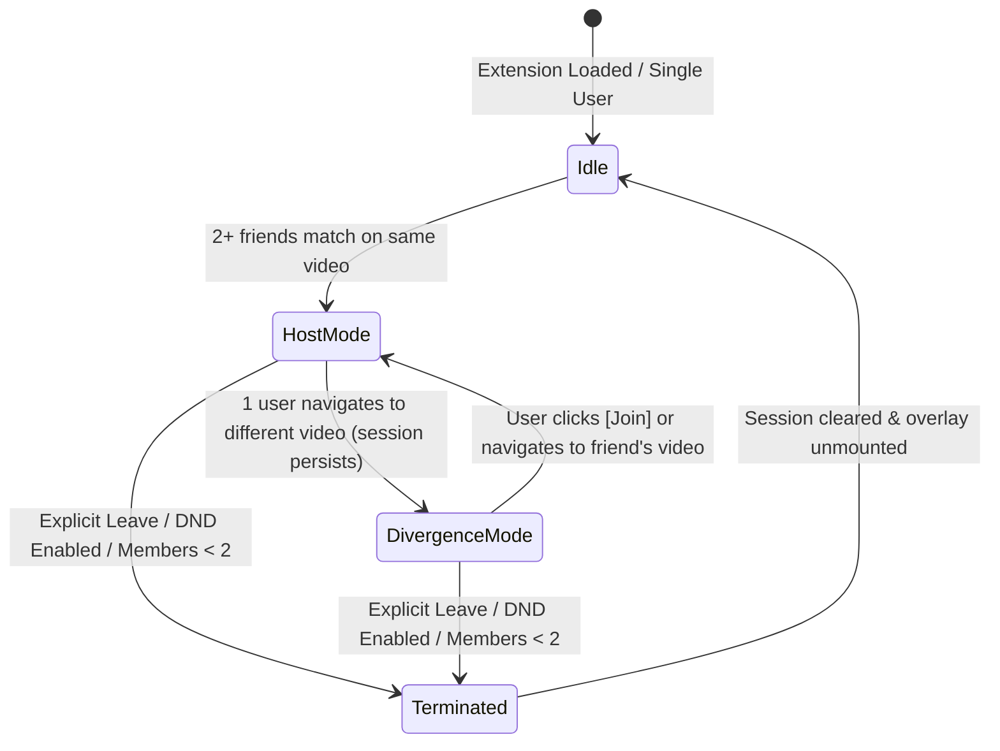

# Session Model, Divergence & Overlay Specification

## 1. Overview & Core Philosophy

In Hang Time, a **Co-Watch Session** is an explicit, user-controlled social group. Unlike simple transient video matching, sessions persist across media transitions (**Divergence**), allowing friends to browse different videos while remaining connected in chat and easily following each other with one-click navigation.

---

## 2. Data Model

### 2.1 CoWatchSession
Stored locally in `STORAGE_KEYS.ACTIVE_SESSION`:

```typescript
interface CoWatchSession {
  session_id: string;              // Deterministic or UUID v4 session identifier
  co_watchers: string[];           // Array of member UUIDs (includes self)
  created_at: number;              // Unix timestamp ms
  is_active: boolean;              // True while user is actively in session
  last_activity_id?: string;       // Most recent common media identifier
}
```

### 2.2 Overlay State
Broadcasted to the in-page content script overlay via `CO_WATCH_UPDATE`:

```typescript
interface OverlayState {
  is_active: boolean;              // Whether overlay is displayed
  session_id: string | null;       // Active session ID
  is_host: boolean;                // Whether local user is elected host
  host_user_id: string | null;     // UUID of host
  watching_together: string[];     // UUIDs watching the exact same video
  session_members: string[];       // All members of the active session
  co_watcher_activities: Record<string, {
    activity_id: string;
    content: string;               // Video title
    service: string;
    timestamp: number;
    url?: string;                  // Direct URL for JOIN_GUEST_ACTIVITY
    metadata?: {
      progress?: number;
      progress_measured_at?: number;
      duration?: number;
      state?: 'playing' | 'paused';
    };
  }>;
  nicknameMap: Record<string, string>; // UUID -> Display name
  pinned?: boolean;                // User pinned overlay to prevent auto-hide
  discord_voice_link?: string | null;
  dnd?: boolean;                   // Local user DND status
}
```

---

## 3. Session Lifecycle & Transitions



### 3.1 Session Creation
- Triggered by `CoWatcherDetector.detectCoWatchSession()`.
- Condition: 2+ active members (self + non-DND friends) have matching `activity.id` on supported video services with fresh timestamps (< 10 minutes old).
- The earliest `contentTimestamp` deterministically elects the Host.

### 3.2 Divergence (Browsing Different Videos)
- When a member navigates to a different video, the session is **NOT** destroyed.
- The session members list is preserved in storage.
- The overlay automatically switches to **Divergence / Guest Mode**.

### 3.3 Rejoining (`JOIN_GUEST_ACTIVITY`)
- While in Divergence Mode, each friend's card displays the friend's current video title and a `[Join]` button.
- Clicking `[Join]` posts `JOIN_GUEST_ACTIVITY` to the background service worker with `activity_url` or `activity_id`.
- Background navigates the current tab (`chrome.tabs.update`), immediately re-aligning the user with the friend and restoring **Host Mode**.

### 3.4 Session Termination
A session is terminated and overlay unmounted when:
1. The user clicks **Leave Session** on the overlay.
2. The user enables **Do Not Disturb (DND) / Solo Mode**.
3. All friends disconnect or drop offline (> 60 minutes inactive), leaving fewer than 2 active members.

---

## 4. Overlay UI Rendering Modes

The in-page overlay (`#hang-time-overlay`) renders inside an isolated container in two dynamic modes:

### 4.1 Mode A: Host Mode (`watching_together >= 2`)
Active when 2 or more participants are on the exact same video:
- **Host Chip & Title**: Displays current host badge and video name.
- **Synchronized Progress Bar**:
  - **Host View**: Green progress fill tracks host video progress. Multi-guest colored vertical pins (`.guest-marker`) show each connected guest's real-time position with interpolation.
  - **Guest View**:
    - The green progress fill (`#progress-bar-fill`) and time display (`#progress-time-display`) reflect the **Host's position**, continuously interpolated by a 1-second animation loop even when the guest's local player is paused.
    - **Local Position Marker (`#user-position-marker`)**: Always visible 3px vertical bar colored with the user's participant color, marking the local guest's playback position.
    - **Divergence Arrow (`#progress-bar-marker`) & Gap Line (`#gap-indicator`)**: Appear with hysteresis when the distance to the host exceeds 6 seconds (`gap > 6s`) and hide when within 4 seconds (`gap < 4s`). The arrow sits adjacent to the vertical position bar, pointing right (`arrow-right`) if the user is behind the host or left (`arrow-left`) if ahead.
    - **Sync Button (`#progress-sync-button` / `↺`)**: Visible for guests; clicking immediately seeks the local video element to the host's extrapolated position.
- **Control Buttons**: Sync Playback (`↺`), Discord Voice link, Chat toggle (`💬`), and Leave (`✕`).
- **In-Overlay Chat**: Displays incoming/outgoing encrypted session messages with sender attendee chips.

### 4.2 Mode B: Guest / Divergence Mode (`watching_together < 2`)
Active when session members are browsing different media:
- **"Choose Next" Header**: Prompts the user to pick where the group should hang out next.
- **Friend Activity Cards**: Shows each diverged friend's avatar, name, current video title, and a prominent `[Join]` button.
- **Preserved Chat Box**: Session chat remains open and fully functional so friends can discuss what to watch next.

---

## 5. Do Not Disturb (DND) / Solo Mode

DND mode provides total privacy without disconnecting from the social network:

| Behavior | Standard Mode (`Available`) | DND Mode (`Do Not Disturb`) |
| :--- | :--- | :--- |
| **Activity Publishing** | Published to Nostr (`dnd: false`) | Published to Nostr (`dnd: true` tag) |
| **Auto Session Detection** | Automatically joins sessions | **Bypassed completely** |
| **In-Page Overlay** | Displays when co-watching | **Never appears / unmounted** |
| **Friend Presence** | Active / Inactive | Displayed as `⛔ DND` in friends list |
| **Join / Invite Actions** | Enabled | **Disabled / Grayed out** in popup & modals |
| **Active Session Impact** | Participates normally | **Evicted immediately** from existing sessions |

---

## 6. Freshness & Inactivity Rules

To prevent ghost overlays from stale data:
- **Active (< 15 mins)**: Rendered at full opacity (1.0).
- **AFK (15–60 mins)**: Rendered at 0.5 opacity (grayed).
- **Offline (> 60 mins)**: Removed from active session display.
- **Local User ("You")**: Always rendered at full opacity (1.0).
